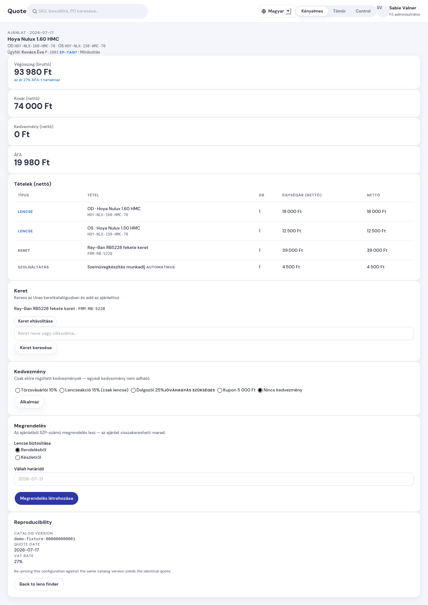

# Hogyan hozok létre megrendelést az ajánlatból

**Mikor kell ez?** Amikor az ügyfél elfogadta az ajánlatot, és indítjuk a
tényleges megrendelést (lencse rendelés vagy készletről készítés).

**Előfeltétel:** összeállított ajánlat a képernyőn (Lencsekereső → pár
kiválasztva → Ajánlat oldal), lehetőleg kiválasztott ügyféllel.

## Lépések

1. Az **Ajánlat** oldalon a jobb oldali oszlopban keresd a **Megrendelés**
   kártyát.
2. Válaszd ki, honnan lesz a lencse:
   - **Rendelésből** — a lencsét a beszállítótól rendeljük (ez az
     alapértelmezett);
   - **Készletről** — a lencse megvan a boltban.
3. Írd be a **vállalt határidőt** (pl. `2026-07-22`). Ha üresen hagyod,
   a rendszer 3 munkanapot ír be automatikusan.
4. Nyomd meg a **Megrendelés létrehozása** gombot.

## Mi történik ilyenkor?

- A megrendelés **SZP-számot** kap (pl. `SZP-2607-0001`) — ez kerül a
  munkalapra és később a számlára is. (A régi ClearVisio SO-számok csak az
  áthozott megrendeléseken maradnak meg.)
- Az ajánlat eltárolódik és **Átalakítva** állapotba kerül — később is
  visszakereshető, ugyanazokkal az árakkal.
- A rendszer átirányít a megrendelés adatlapjára, ahol az eseménynaplóban
  látod a „Megrendelés felvéve" sort a neveddel.

## Gyakori kérdések

- **Elkattintottam kétszer a gombot — két megrendelés lett?** Nem: a
  második kattintás ugyanarra a megrendelésre visz.
- **Rossz kedvezmény van az ajánlaton.** A megrendelés a képernyőn látott
  árakkal jön létre — előbb javítsd az ajánlaton a kedvezményt, utána
  hozd létre a megrendelést.
- **Nincs kiválasztott ügyfél.** Megrendelést ügyfél nélkül is fel tudsz
  venni, de a munkalapon és a számlán üres marad a név — inkább válassz
  ügyfelet (Ügyfelek menü), betérőnél Z1-rögzítés.
