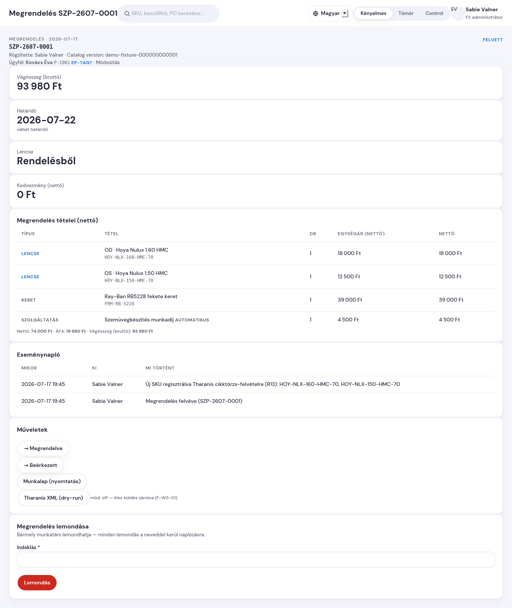

# Hogyan kezelem a megrendelés státuszát (és hogyan mondom le)

**Mikor kell ez?** Amikor a megrendeléssel történik valami: megrendelted a
lencsét, beérkezett, elkészült, az ügyfél átvette — vagy le kell mondani.

## Státusz léptetése

1. Nyisd meg a megrendelést (Megrendelések lista → **Megtekintés**).
2. A jobb oldali **Műveletek** kártyán csak azok a gombok látszanak,
   amerre a megrendelés innen léphet (pl. Felvett után: **→ Megrendelve**
   vagy — készletes lencsénél — **→ Beérkezett**).
3. Kattints a megfelelő gombra. A váltás azonnal bekerül az
   **eseménynaplóba** a neveddel és az időponttal.

Visszafelé léptetni nem lehet — ha tévedtél, írd meg Sabie-nak.

## Lemondás

1. Az adatlap jobb alsó **Megrendelés lemondása** kártyáján írd be az
   **indoklást** (kötelező — pl. „ügyfél visszalépett").
2. Nyomd meg a **Lemondás** gombot, és erősítsd meg a felugró kérdést.

Fontos tudni:

- **Bármelyik kolléga lemondhat** bármilyen megrendelést — de minden
  lemondás naplóba kerül a lemondó nevével. Ez nem bizalmatlanság, hanem
  visszakereshetőség.
- A lemondás **végleges**: a megrendelés lezárul, új státusza nem lehet.
  Ha mégis kell a szemüveg, hozz létre új megrendelést az ajánlatból (az
  ajánlat visszakereshető maradt).
- Ha már készült számla vagy előleg, annak rendezése a pénztári/számlázási
  folyamatban történik (M8 — később kerül a Szempontba; addig a megszokott
  Számlázz.hu úton).

## Munkalap nyomtatása

A **Munkalap (nyomtatás)** gomb a műhely-munkalapot nyitja meg, előtöltve
a megrendelés adataival (SZP-szám vonalkóddal, lencsék, keret, határidő) —
nyomtasd, és mehet a műhelybe a kerettel együtt.
