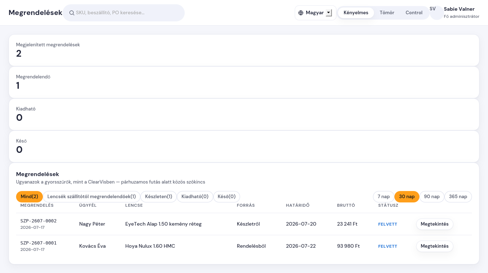

# Hogyan találom meg és szűröm a megrendeléseket

**Mikor kell ez?** Reggeli rutin: mit kell ma beszállítótól megrendelni,
mi vár kiadásra, mi csúszik.

## Lépések

1. Bal menü → **Megrendelések**.
2. A lista tetején ugyanazok a gyorsszűrők, mint a ClearVisben — kattints
   arra, amelyik kell:
   - **Mind** — minden megrendelés az időszakban;
   - **Lencsék szállítótól megrendelendőek** — felvett megrendelések,
     amikhez még nem rendeltük meg a lencsét;
   - **Készleten** — a lencse megvan (beérkezett, vagy készletről készül);
   - **Kiadható** — kész / QC-kész szemüvegek, az ügyfél jöhet értük;
   - **Késő** — a vállalt határidő elmúlt, és még nincs átadva.
3. Jobb oldalt az **időszak** váltó (7 / 30 / 90 / 365 nap) — alapból az
   utolsó 30 nap látszik.
4. A sor végi **Megtekintés** gomb visz a megrendelés adatlapjára.

## Mit jelentenek a státuszok?

| Státusz | Jelentés |
|---|---|
| Felvett | rögzítve, lencse még nincs megrendelve |
| Megrendelve | lencse megrendelve a beszállítótól |
| Beérkezett | lencse beérkezett / készletről kivéve |
| Csiszolás | műhelyben, munkában |
| Kész | szemüveg elkészült |
| QC-kész | minőség-ellenőrzés megvolt (másik kolléga, papíron igazolva) |
| Átadva | ügyfél átvette — lezárt |
| Lemondva | lemondva — lezárt (az indoklás az adatlapon látszik) |

A piros **késő** címke a státusztól függetlenül megjelenik, ha a határidő
elmúlt.
